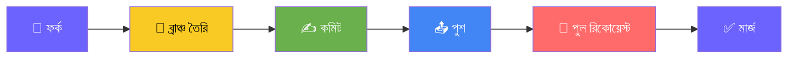

# কাব্যলোকের ব্রক্ষকবি (Kabboloker Brakkhakbi)

<p align="center">
  
</p>

<p align="center">
  <a href="https://github.com/Tasibtohs/kabboloker-brakkhakbi_V1.0.3/releases/latest">
    
  </a>
  <a href="https://github.com/Tasibtohs/kabboloker-brakkhakbi_V1.0.3/blob/main/LICENSE">
    
  </a>
  <a href="https://github.com/Tasibtohs/kabboloker-brakkhakbi_V1.0.3">
    
  </a>
  <a href="https://github.com/Tasibtohs/kabboloker-brakkhakbi_V1.0.3/actions">
    
  </a>
</p>

<p align="center">
  <b>একটি আধুনিক, নমনীয় এবং দৃষ্টিনন্দন বাংলা নোটপ্যাড ও সাহিত্য লিখন অ্যান্ড্রয়েড অ্যাপ্লিকেশান।</b><br>
  লেখক, কবি ও সাধারণ ব্যবহারকারীদের সুবিধার্থে বিশেষ বাংলা ফন্ট, ক্যাটাগরি, হিডেন নোটস, ট্র্যাশ বিন, পিডিএফ এক্সপোর্ট এবং ব্যাকআপ সুবিধা প্রদান করে।
</p>

---

## 📸 স্ক্রিনশট

<div align="center">
  
| হোম স্ক্রিন | এডিটর | ফন্ট সিলেক্টর | পিডিএফ এক্সপোর্ট |
|:---:|:---:|:---:|:---:|
|  |  |  |  |

</div>

---


## 🌟 বৈশিষ্ট্যসমূহ (Features)

| ক্যাটাগরি | বৈশিষ্ট্য |
|-----------|-----------|
| 📝 **ফন্ট** | ২০+ বাংলা ফন্ট সাপোর্ট (আলিনুর, বনলতা, বাসন্তী, কবিতা, মাহফুজ, শরীফা ফিফা, সবুজ নলুয়া প্রভৃতি) |
| 🎨 **স্টাইলিং** | রিচ টেক্সট এডিটিং, ফন্ট সাইজ, টেক্সট কালার, ব্যাকগ্রাউন্ড কালার কাস্টমাইজেশন |
| 📂 **ক্যাটাগরি** | নোট গ্রুপ ও বিভাগ অনুযায়ী সাজানোর ব্যবস্থা |
| 🔒 **গোপনীয়তা** | পাসওয়ার্ড সুরক্ষিত হিডেন নোটস |
| 🗑️ **ট্র্যাশ** | মুছে ফেলা নোট পুনরুদ্ধার (৩০ দিন পর্যন্ত) |
| 📄 **পিডিএফ** | নোট থেকে পিডিএফ তৈরি ও শেয়ার |
| 💾 **ব্যাকআপ** | লোকাল ব্যাকআপ ও রিস্টোর সিস্টেম |
| 🌙 **ডার্ক মোড** | লাইট/ডার্ক থিম সাপোর্ট |
| 🔍 **সার্চ** | সব নোটে দ্রুত অনুসন্ধান |

---

## 📥 ডাউনলোড

<div align="center">

[](https://github.com/Tasibtohs/kabboloker_brakkhakbi/releases/latest)
[](https://github.com/Tasibtohs/kabboloker_brakkhakbi/releases)

</div>


---


### 📲 ইন্সটলেশন নির্দেশনা

<div align="left">

<table>
<tr>
<th>#</th>
<th>ধাপ</th>
<th>বিবরণ</th>
</tr>
<tr>
<td align="center">1</td>
<td>⬇️ ডাউনলোড</td>
<td>APK ফাইল ডাউনলোড করুন</td>
</tr>
<tr><td align="center">2</td>
<td>⚙️ অনুমতি</td>
<td>Settings → Security → Unknown Sources</td>
</tr>
<tr>
<td align="center">3</td>
<td>📲 ইন্সটল</td>
<td>APK ফাইলে ট্যাপ করে ইন্সটল করুন</td>
</tr>
<tr>
<td align="center">4</td>
<td>🚀 চালু</td>
<td>ইন্সটল সম্পন্ন হলে অ্যাপটি ওপেন করুন</td>
</tr>
</table>

</div>

> ⚠️ **দ্রষ্টব্য:** অ্যাপটি ন্যূনতম **Android 7.0 (API 24)** বা তার উপরে চলে।

---

## 🛠 টেকনোলজি স্ট্যাক

<div align="left">

<table>
<tr>
<th>প্রযুক্তি</th>
<th>ব্যবহার</th>
<th>সংস্করণ</th>
<th>আইকন</th>
</tr>
<tr>
<td>Kotlin</td>
<td>ভাষা</td>
<td>1.9.0</td>
<td></td>
</tr>
<tr>
<td>Jetpack Compose</td>
<td>UI ফ্রেমওয়ার্ক</td>
<td>1.5.0</td>
<td></td>
</tr>
<tr>
<td>Material Design 3</td>
<td>ডিজাইন সিস্টেম</td>
<td>3</td>
<td></td>
</tr>
<tr>
<td>Room</td>
<td>লোকাল ডেটাবেস</td>
<td>2.5.2</td>
<td></td>
</tr>
<tr>
<td>MVVM</td>
<td>আর্কিটেকচার</td>
<td>-</td>
<td></td>
</tr>
<tr>
<td>Coroutines</td>
<td>অ্যাসিঙ্ক্রোনাস</td>
<td>1.7.3</td>
<td></td>
</tr>
<tr>
<td>PDF</td>
<td>PDF ইঞ্জিন</td>
<td>-</td>
<td></td>
</tr>
<tr>
<td>GitHub Actions</td>
<td>CI/CD</td>
<td>-</td>
<td></td>
</tr>
</table>

</div>

---

## 📊 রোডম্যাপ

<div align="left">

### ✅ v1.0.0 — বর্তমান সংস্করণ

| সম্পন্ন | ফিচার | স্ট্যাটাস |
|---------|--------|-----------|
| ✅ | মৌলিক নোট CRUD | 🟢 সম্পূর্ণ |
| ✅ | ২০+ বাংলা ফন্ট | 🟢 সম্পূর্ণ |
| ✅ | ক্যাটাগরি ব্যবস্থাপনা | 🟢 সম্পূর্ণ |
| ✅ | ট্র্যাশ বিন | 🟢 সম্পূর্ণ |
| ✅ | PDF এক্সপোর্ট | 🟢 সম্পূর্ণ |
| ✅ | লোকাল ব্যাকআপ | 🟢 সম্পূর্ণ |
| ✅ | ডার্ক/লাইট থিম | 🟢 সম্পূর্ণ |

### 🚀 v1.1.0 — আসন্ন

| আসন্ন | ফিচার | স্ট্যাটাস |
|--------|--------|-----------|
| ⏳ | Google Drive ব্যাকআপ | 🟡 উন্নয়নাধীন |
| ⏳ | ভয়েস টু টেক্সট | 🟡 উন্নয়নাধীন |
| ⏳ | বাংলা বানান সংশোধন | 🟡 উন্নয়নাধীন |
| ⏳ | ওয়ার্ড কাউন্ট লাইভ | 🟡 উন্নয়নাধীন |

### 🌟 v1.2.0 — ভবিষ্যৎ

| পরিকল্পনা | ফিচার | স্ট্যাটাস |
|-----------|--------|-----------|
| 💡 | AI কন্টেন্ট জেনারেশন | ⚪ পরিকল্পনা |
| 💡 | সোশ্যাল মিডিয়া শেয়ারিং | ⚪ পরিকল্পনা |
| 💡 | মাল্টি-ডিভাইস সিঙ্ক | ⚪ পরিকল্পনা |
| 💡 | প্লাগইন সিস্টেম | ⚪ পরিকল্পনা |

</div>

---

## 🤝 কন্ট্রিবিউশন

<div align="center">



</div>

### 📋 প্রক্রিয়া

| ধাপ | বিবরণ |
|-----|--------|
| ১ | রিপোজিটরি **ফর্ক** করুন |
| ২ | নতুন ব্রাঞ্চ তৈরি করুন: `git checkout -b feature/আপনার-ফিচার` |
| ৩ | পরিবর্তন করুন ও কমিট করুন: `git commit -m 'যোগ করুন: নতুন ফিচার'` |
| ৪ | ব্রাঞ্চ পুশ করুন: `git push origin feature/আপনার-ফিচার` |
| ৫ | **পুল রিকোয়েস্ট** খুলুন |

---

## 📄 লাইসেন্স

<div align="center">

```
╔══════════════════════════════════════════════════════════════════════════════╗
║                                                                              ║
║                       📖  কাব্যলোকের ব্রক্ষকবি                              ║
║                  Kabboloker Brakkhakbi — The Poet's Notebook                ║
║                                                                              ║
║                          Bengali Poetry & Literature App                    ║
║                                                                              ║
║  ═════════════════════════════════════════════════════════════════════════  ║
║                                                                              ║
║                         Copyright © 2026 HM Ibrahim Sarkar                  ║
║                              All Rights Reserved                            ║
║                                                                              ║
║  ═════════════════════════════════════════════════════════════════════════  ║
║                                                                              ║
║                                                                              ║
║     📌   এই অ্যাপ্লিকেশনটির সমস্ত অধিকার সংরক্ষিত।                        ║
║                                                                              ║
║     📌   অনুমতি ছাড়া এই অ্যাপ্লিকেশন বা এর কোনো অংশ                       ║
║          কপি, পরিবর্তন, বিতরণ, বা পুনঃপ্রকাশ করা যাবে না।                 ║
║                                                                              ║
║     📌   সোর্স কোড শুধুমাত্র শিক্ষাগত উদ্দেশ্যে                           ║
║          দেখার জন্য উন্মুক্ত।                                              ║
║                                                                              ║
║     📌   বাণিজ্যিক ব্যবহার সম্পূর্ণ নিষিদ্ধ।                              ║
║                                                                              ║
║  ═════════════════════════════════════════════════════════════════════════  ║
║                                                                              ║
║     📧  hmibrahimsarkar@gmail.com                                          ║
║     🐦  @hmibrahimsarkar                                                   ║
║     🏠  github.com/Tasibtohs                                               ║
║                                                                              ║
║  ═════════════════════════════════════════════════════════════════════════  ║
║                                                                              ║
║     🛡️  Protected by International Copyright Laws                          ║
║     📅  Last Updated: January 2026                                         ║
║     📍  Dhaka, Bangladesh                                                  ║
║                                                                              ║
╚══════════════════════════════════════════════════════════════════════════════╝
```

</div>

### 📜 লাইসেন্স বিস্তারিত

<div align="left">

| বিষয় | বিবরণ |
|------|--------|
| **📖 নাম** | কাব্যলোকের ব্রক্ষকবি (Kabboloker Brakkhakbi) |
| **👨‍💻 মালিক** | HM Ibrahim Sarkar |
| **📅 কপিরাইট** | © 2026 |
| **🔒 অধিকার** | সর্বস্বত্ব সংরক্ষিত |
| **✅ অনুমতি** | শিক্ষাগত উদ্দেশ্যে দেখার জন্য উন্মুক্ত |
| **❌ নিষেধ** | বাণিজ্যিক ব্যবহার, কপি, পরিবর্তন, বিতরণ |
| **⚖️ আইন** | আন্তর্জাতিক কপিরাইট আইন দ্বারা সুরক্ষিত |
| **📧 যোগাযোগ** | hmibrahimsarkar@gmail.com |

</div>

### ⚠️ লাইসেন্স শর্তাবলী

<div align="left">

| ✅ যা করতে পারেন | ❌ যা করতে পারবেন না |
|------------------|----------------------|
| 📖 সোর্স কোড দেখতে পারেন | 🚫 বাণিজ্যিক ব্যবহার করতে পারবেন না |
| 🎓 শিক্ষাগত উদ্দেশ্যে ব্যবহার করতে পারেন | 🚫 কোড কপি করতে পারবেন না |
| 📚 গবেষণার জন্য ব্যবহার করতে পারেন | 🚫 কোড পরিবর্তন করতে পারবেন না |
| 🔍 কোড বিশ্লেষণ করতে পারেন | 🚫 কোড বিতরণ করতে পারবেন না |
| | 🚫 পুনঃপ্রকাশ করতে পারবেন না |

</div>

### 📞 লাইসেন্স সম্পর্কিত যোগাযোগ

<div align="center">

**লাইসেন্স সম্পর্কিত যেকোনো প্রশ্ন বা বিশেষ অনুমতির জন্য যোগাযোগ করুন:**

[](mailto:hmibrahimsarkar@gmail.com)
[](https://twitter.com/hmibrahimsarkar)
[](https://github.com/Tasibtohs)

</div>

### 🛡️ কপিরাইট সুরক্ষা

<div align="center">

```
╔═══════════════════════════════════════════════════════════════════╗
║                                                                   ║
║   ⚖️  এই অ্যাপ্লিকেশনটি আন্তর্জাতিক কপিরাইট আইন দ্বারা সুরক্ষিত   ║
║                                                                   ║
║   📌  DMCA Digital Millennium Copyright Act                      ║
║   📌  Bangladesh Copyright Act 2000                             ║
║   📌  Berne Convention for the Protection of                    ║
║        Literary and Artistic Works                              ║
║                                                                   ║
║   ⚠️  কপিরাইট লঙ্ঘন আইনত অপরাধ এবং এর জন্য                       ║
║       আইনি ব্যবস্থা গ্রহণ করা হবে।                               ║
║                                                                   ║
╚═══════════════════════════════════════════════════════════════════╝
```

</div>

</div>

---

## 👨‍💻 ডেভেলপার

<div align="center">

### HM Ibrahim Sarkar
*Android Developer | Tech Enthusiast | Literature Lover*

<br>

[](https://github.com/Tasibtohs)
[](mailto:hmibrahimsarkar@gmail.com)
[](https://www.facebook.com/hmibrahimsarkar)
[](https://twitter.com/hmibrahimsarkar)
[](https://linkedin.com/in/hmibrahimsarkar)

<br>


</div>

---

## 🙏 কৃতজ্ঞতা

<div align="left">

| | |
|---|---|
| **সবুজ নলুয়া** | প্রসেনজিৎ মণ্ডল |
| **আলিনুর ফন্ট পরিবার** | আলিনুর রহমান |
| **বনলতা** | মাহফুজ এ. কে. |
| **শরীফা ফিফা** | শরীফা ফিফা |
| **বাংলা টাইপোগ্রাফি কমিউনিটি** | বাংলা ফন্ট ডেভেলপমেন্টের জন্য |
| **অ্যান্ড্রয়েড ডেভেলপার কমিউনিটি** | Jetpack Compose ও Material Design 3-এর জন্য |
| **Open Source Contributors** | সকল কন্ট্রিবিউটরদের প্রতি |

</div>

---

## 📞 যোগাযোগ

<div align="left">

| মাধ্যম | লিংক |
|--------|------|
| 📧 ইমেইল | hmibrahimsarkar@gmail.com |
| 🐛 বাগ রিপোর্ট | [GitHub Issues](https://github.com/Tasibtohs/kabboloker-brakkhakbi/issues) |
| 💡 ফিচার রিকোয়েস্ট | [GitHub Discussions](https://github.com/Tasibtohs/kabboloker-brakkhakbi/discussions) |
| 📱 ফেসবুক | [HM Ibrahim Sarkar](https://www.facebook.com/hmibrahimsarkar) |
| 🐦 টুইটার | [@hmibrahimsarkar](https://twitter.com/hmibrahimsarkar) |

</div>

---

## ⭐ সাপোর্ট

<div align="center">
  
**এই প্রজেক্টটি ভালো লাগলে GitHub এ একটি ⭐ দিন!**

[](https://github.com/Tasibtohs/kabboloker-brakkhakbi_V1.0.3)
[](https://github.com/Tasibtohs/kabboloker-brakkhakbi_V1.0.3)
[](https://github.com/Tasibtohs/kabboloker-brakkhakbi_V1.0.3)

</div>

---

### 📅 সংস্করণ ও আপডেট

<div align="left">

| সংস্করণ | তারিখ | পরিবর্তন |
|---------|-------|----------|
| **v1.0.0** | জানুয়ারি ২০২৬ | প্রথম রিলিজ |
| **v1.0.1** | জানুয়ারি ২০২৬ | লাইসেন্স আপডেট |
| **v1.0.2** | জানুয়ারি ২০২৬ | কপিরাইট তথ্য যোগ |
| **v1.0.3** | জানুয়ারি ২০২৬ | লাইসেন্স বিস্তারিত যোগ |

</div>

---
## 🔗 লিংকসমূহ

<div align="left">

| লিংক | URL |
|------|-----|
| 🏠 GitHub Repository | [https://github.com/Tasibtohs/kabboloker-brakkhakbi_V1.0.3](https://github.com/Tasibtohs/kabboloker-brakkhakbi_V1.0.3) |
| 📦 Releases | [https://github.com/Tasibtohs/kabboloker-brakkhakbi_V1.0.3/releases](https://github.com/Tasibtohs/kabboloker-brakkhakbi_V1.0.3/releases) |
| 🐛 Issues | [https://github.com/Tasibtohs/kabboloker-brakkhakbi_V1.0.3/issues](https://github.com/Tasibtohs/kabboloker-brakkhakbi_V1.0.3/issues) |
| 💬 Discussions | [https://github.com/Tasibtohs/kabboloker-brakkhakbi_V1.0.3/discussions](https://github.com/Tasibtohs/kabboloker-brakkhakbi_V1.0.3/discussions) |
| 📄 License | [https://github.com/Tasibtohs/kabboloker-brakkhakbi_V1.0.3/blob/main/LICENSE](https://github.com/Tasibtohs/kabboloker-brakkhakbi_V1.0.3/blob/main/LICENSE) |

</div>

---

<div align="center">


**❤️ বাংলা সাহিত্যকে ডিজিটাল প্ল্যাটফর্মে ছড়িয়ে দিন ❤️**

[](https://github.com/Tasibtohs)
[](https://en.wikipedia.org/wiki/Bangladesh)

**© 2026 Kabboloker Brakkhakbi — All Rights Reserved**

</div>

